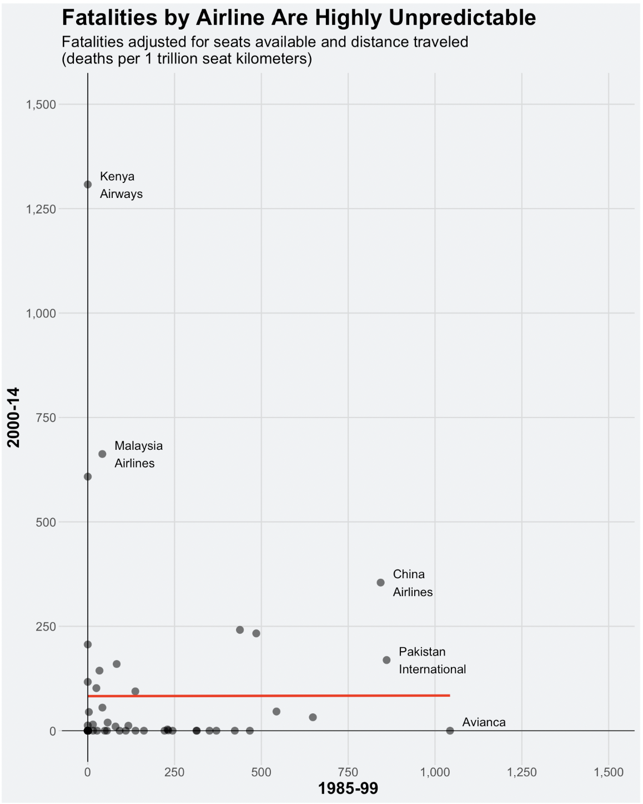

# STAT1261_Fall2022

Assignments and Visualization Project for STAT1261: Principles of Data Science at the University of Pittsburgh

## Visualization Project

This project's goal was to recreate a graphic from a blog article using Data Processsing/Data Visualization techniques in R.

My recreation:

--Original image can be found on the owner's article as the 2nd graphic titled "Fatalities by Airline Are Highly Unpredictable"--

Original Image/Data attributed to Nate Silver
Image: https://fivethirtyeight.com/features/should-travelers-avoid-flying-airlines-that-have-had-crashes-in-the-past/
Data: https://github.com/fivethirtyeight/data/tree/master/airline-safety
